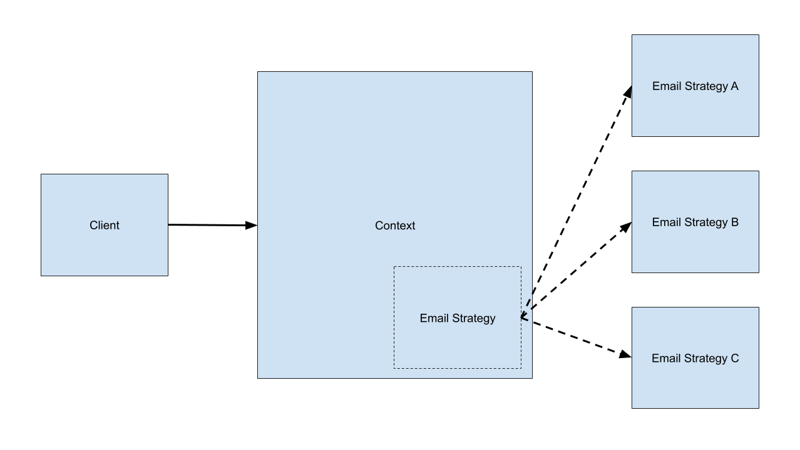

# emailer-strategy-pattern

Implement different email approaches by strategy pattern

Run `npm install` to set up the dependencies

Define these env variables:

- EMAIL_HOST
- EMAIL_PORT
- EMAIL_SECURE
- EMAIL_USER
- EMAIL_PASS
- EMAIL_SENDER
- EMAIL_RECEIVER

Run `npm test` to check if everything is working as expected
